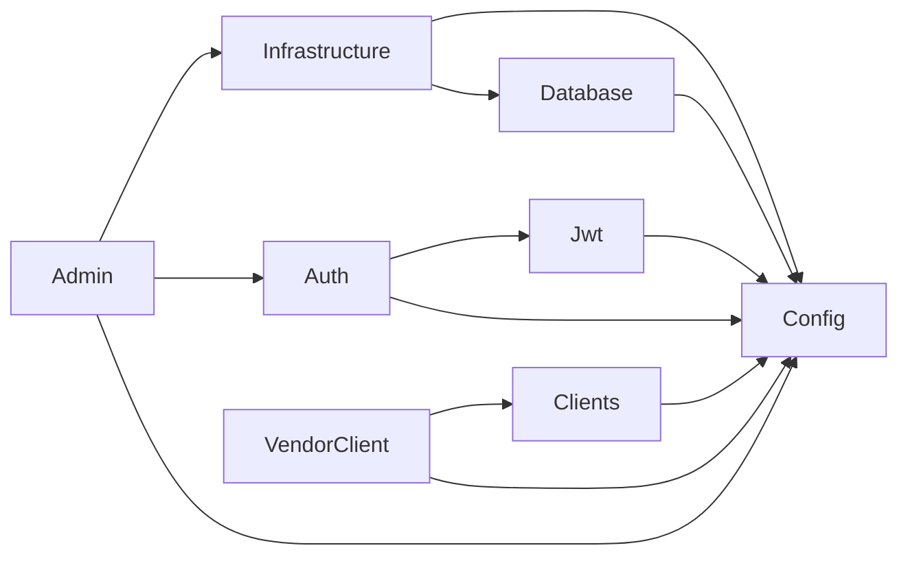
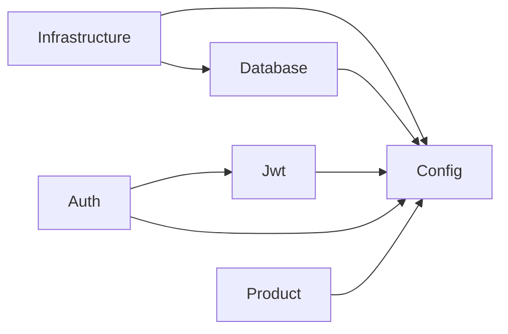

## Description

Basic version of the E-Procurement system with the following :

1. Vendor Registration and Approval
2. Product Catalog Management

## Compile and run the project

```bash
$ docker compose up
```

## Module Graph Admin Service

This section provides a visual representation of the module dependencies within the NestJS application. The graph is generated using Mermaid syntax and helps to understand how different modules in the application are interconnected.



## Module Graph Vendor Service

This section provides a visual representation of the module dependencies within the NestJS application. The graph is generated using Mermaid syntax and helps to understand how different modules in the application are interconnected.


